<div align="center">

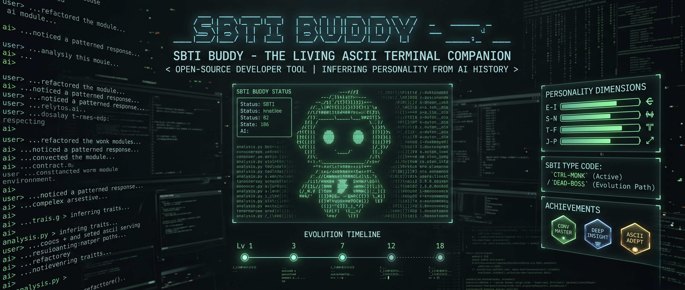

<br>

[](https://opensource.org/licenses/MIT)
[](https://claude.ai/claude-code)
[](https://github.com/Li-xingXiao/sbti-buddy-skill)

**Personality tests capture a moment. Your AI conversations reveal who you really are.**

**性格测试只能测出一瞬间的你。和 AI 的长期对话，才是真实的你。**

[English](#what-is-sbti-buddy) · [中文](#sbti-buddy-是什么) · [Quick Start](#quick-start--快速开始)

</div>

---

## What is SBTI Buddy?

A **Claude Code skill** built on [SBTI-Test](https://sbti.fancc.de5.net/) — a personality framework designed specifically for programmers. While the original SBTI uses a questionnaire, SBTI Buddy skips the form entirely: it reads your AI conversation history and **automatically** determines your type. No questionnaire needed.

It generates:

- **🎴 Programmer Personality Type** — 27 programmer-specific archetypes across 5 behavioral models and 15 dimensions. Not generic MBTI — types like `CTRL (Ctrl+S the Architect)`, `DEAD (404 the Unmotivated)`, `MONK (Vim僧 the Terminal Sage)`
- **🐾 Animated ASCII Buddy** — a companion that lives in your Claude Code statusline. It blinks when idle, animates while Claude responds, and changes mood throughout the day
- **🧠 Companion Skill** — auto-installed skill that gives your buddy a voice. It comments on your code (in character), reminds you to rest after 10pm, and celebrates your achievements
- **🎙️ Communication Style Adaptation** — Claude adapts how it talks to you based on your personality: verbosity, tone, assertiveness, proactivity, and decision framing. **Only changes communication style — never affects reasoning or technical accuracy**
- **📈 Evolution Tracking** — your type changes over time. SBTI Buddy records every shift and shows your programmer growth timeline
- **🏆 15 Achievements** — unlock badges like `🦉 Night Owl`, `💀 Back from Dead`, `🧘 Code Monk`

> **Why no questionnaire?** Personality tests measure how you *think* you are in that moment. But your real coding personality shows in thousands of conversations — how you ask for help, how you respond to errors, how you communicate with AI. That can't be faked. SBTI Buddy reads the truth from your history.

---

## SBTI Buddy 是什么？

一个基于 [SBTI测试](https://sbti.fancc.de5.net/) 构建的 **Claude Code 技能**。SBTI 是专为程序员设计的人格框架，原版需要做测试题，而 SBTI Buddy 完全跳过问卷——直接读取你的 AI 对话历史，**自动**判定你的类型。不需要做任何测试题。

它会生成：

- **🎴 程序员人格类型** — 27 种程序员专属人格原型，覆盖 5 大行为模型、15 个维度。不是泛泛的 MBTI，而是 `CTRL（拿捏者）`、`DEAD（404 开发者）`、`MONK（Vim僧）` 这样的程序员特有类型
- **🐾 动态 ASCII 伙伴** — 住在你 Claude Code 状态栏里的小伙伴。空闲时偶尔眨眼，响应时活蹦乱跳，全天候陪你 coding
- **🧠 伴侣技能** — 自动安装的技能，让你的 buddy 拥有独特的声音。它会用角色语气评论你的代码，晚上 10 点后提醒你休息
- **🎙️ 沟通风格适配** — Claude 会根据你的性格调整跟你说话的方式：详细程度、语气温度、推荐力度、主动性、决策框架。**只改变沟通风格，不影响推理和技术判断**
- **📈 进化追踪** — 你的类型会随时间变化。SBTI Buddy 记录每次转变，展示你的程序员成长轨迹
- **🏆 15 个成就** — 解锁 `🦉 夜猫子`、`💀 起死回生`、`🧘 代码僧侣` 等徽章

> **为什么不做测试题？** 性格测试只能测出你「此刻觉得自己是什么样的人」。但你真实的编程人格，藏在成千上万次对话里——你怎么求助、怎么应对报错、怎么和 AI 沟通。这些没法伪装。SBTI Buddy 从你的历史中读出真相。

---

**Input:** Your `~/.claude/history.jsonl` (read-only, never sent anywhere)

**Output:**

| Output | What you get |
|--------|-------------|
| 🎴 ASCII Share Card | Your SBTI type, DNA pattern, dimension bars — paste anywhere |
| 🐾 Animated Buddy | ASCII companion that lives in your Claude Code statusline |
| 🧠 Companion Skill | Auto-installed skill — buddy reacts, comments, tracks your mood |
| 🎙️ Communication Style | Claude adapts tone, verbosity, assertiveness to your personality (style only, not reasoning) |
| 📈 Evolution Log | Type change history — watch yourself grow over time |

<details>
<summary><b>📸 What it looks like (click to expand)</b></summary>

<br>

```
╭──────────────────────────────────────────╮
│  ✦ SBTI BUDDY CARD                      │
│  ══════════════════                      │
│                                          │
│       \----/       CTRL                  │
│      /^\  /^\      (拿捏者)              │
│     < V    V >                           │
│     (  ----  )     Match:  91%           │
│      \ -[]- /     Style: Architect       │
│      [ CTRL ]      DNA: ██▓░██▓░██       │
│                                          │
│  "Master of the codebase, PR terminator" │
│                                          │
│  ─── Dimensions ─────────────────────    │
│  S  ██ ██ ██                             │
│  E  ██ ▓░ ██                             │
│  A  ▓░ ██ ██                             │
│  Ac ██ ██ ██                             │
│  So ▓░ ██ ▓░                             │
│                                          │
│  ★ ★ ★ ★ ☆ ☆ ☆ ☆ ☆ ☆ ☆ ☆ ☆ ☆ ☆       │
│                                          │
│  Confidence: Deep Portrait               │
│  Generated:  2026-04-14                  │
╰──────────────────────────────────────────╯
```

*The card includes: SBTI type with programmer avatar · 5-model dimension DNA bars · dev style · match similarity · 15 achievement badges · confidence level.*

</details>

<details>
<summary><b>🐾 Meet the buddies (click to expand)</b></summary>

<br>

<table>
<tr>
<td align="center">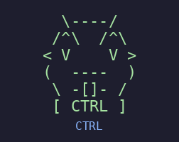<br><b>CTRL</b><br><sub>The Architect</sub></td>
<td align="center">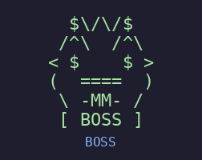<br><b>BOSS</b><br><sub>The Tech Lead</sub></td>
<td align="center">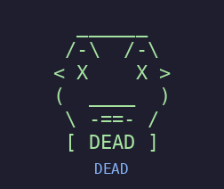<br><b>DEAD</b><br><sub>The 404 Dev</sub></td>
<td align="center">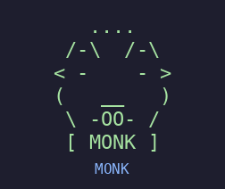<br><b>MONK</b><br><sub>Terminal Sage</sub></td>
<td align="center">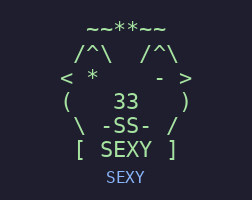<br><b>SEXY</b><br><sub>The Lambda</sub></td>
</tr>
<tr>
<td align="center">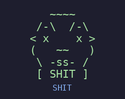<br><b>SHIT</b><br><sub>Angry Shipper</sub></td>
<td align="center">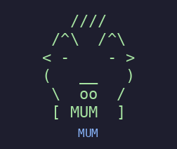<br><b>MUM</b><br><sub>Error Handler</sub></td>
<td align="center">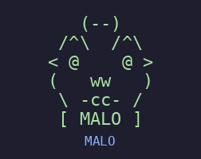<br><b>MALO</b><br><sub>Chaos Monkey</sub></td>
<td align="center">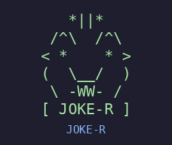<br><b>JOKE-R</b><br><sub>Debug Comedian</sub></td>
<td align="center">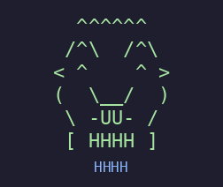<br><b>HHHH</b><br><sub>Happy Coder</sub></td>
</tr>
</table>

*10 of 27 types shown. The rest? Discover yours by running `sbti`.*

*展示了 27 种中的 10 种。剩下的？运行 `sbti` 亲自探索。*

</details>

---

## Quick Start / 快速开始

**Claude Code (marketplace):**

```bash
# Step 1: Add marketplace
/plugin marketplace add Li-xingXiao/sbti-buddy-skill

# Step 2: Install
/plugin install sbti-buddy@sbti-buddy

# Step 3: Run
sbti
```

**Claude Code (manual):**

```bash
git clone https://github.com/Li-xingXiao/sbti-buddy-skill.git
cp -R sbti-buddy-skill/skills/sbti-buddy ~/.claude/skills/sbti-buddy
# Then in Claude Code:
sbti
```

---

## How It Works / 工作流程

```
  📜 Your conversation history (~/.claude/history.jsonl)
                        │
          ┌─────────────▼──────────────┐
          │  Read messages (Quick/Full) │
          │  9 languages · 4 sources    │
          └─────────────┬──────────────┘
                        │
          ┌─────────────▼──────────────┐
          │  Score 15 dimensions        │
          │  5 models × 3 sub-dims     │
          │  S · E · A · Ac · So        │
          └─────────────┬──────────────┘
                        │
          ┌─────────────▼──────────────┐
          │  Euclidean distance match   │
          │  → Best of 27 types         │
          └─────────────┬──────────────┘
                        │
          ┌─────────────▼──────────────┐
          │  Generate outputs           │
          │  🎴 Card  🐾 Buddy  🧠 Skill│
          └─────────────┬──────────────┘
                        │
          ┌─────────────▼──────────────┐
          │  Install companion skill    │
          │  + statusline animation     │
          └────────────────────────────┘
```

---

## 27 Programmer Types / 27 种程序员人格

| Category | Types |
|----------|-------|
| ⚡ **High-Function Leadership** | `CTRL` Ctrl+S · `BOSS` Root · `GOGO` CI/CD · `ATM-er` CashFlow |
| 🧠 **High-Cognition Independent** | `WOC!` Sudo! · `THIN-K` Stack溢 · `SHIT` CoreDump · `POOR` malloc失败 |
| 💚 **Warm Healing** | `MUM` Try-Catch · `THAN-K` ThankU.js · `SEXY` Lambda · `LOVE-R` Merge恋 |
| ⚖️ **Balanced Middle** | `FAKE` .env · `OG8K` Legacy · `MALO` Chaos猴 · `JOKE-R` Bug丑 |
| 😵 **Low-Function Struggling** | `IMFW` Ghost线程 · `IMSB` /dev/null · `DEAD` 404 · `SOLO` Daemon |
| 🔧 **Specialist** | `ZZZZ` Sleep(∞) · `MONK` Vim僧 · `FU?K` rm -rf · `OH-NO` Segfault |
| ✨ **Special** | `HHHH` Hello World · `DIOR-s` Refactor君 |

> 🌙 **Easter egg**: If >50% of your messages are sent between 00:00–05:00, you unlock the **Late Night Coder** badge — with a special dark-circles avatar overlay.

Each type comes with: ASCII avatar · programmer-flavored intro · coding portrait · buddy catchphrase · dev style label.

---

## The 5 Models / 五大模型

| Model | Dimensions | What it measures |
|-------|-----------|-----------------|
| **S** — Self-Image | Code Confidence · Requirements Clarity · Technical Ambition | How you see yourself as a programmer |
| **E** — AI Relationship | AI Trust · Conversation Depth · Independence | How you interact with AI tools |
| **A** — Tech Worldview | Tech Optimism · Code Standards · Project Direction | Your philosophy about code and technology |
| **Ac** — Execution Style | Growth vs Safety · Decision Speed · Task Completion | How you get things done |
| **So** — Communication | Initiative · AI Boundary · Expression Style | How you communicate and collaborate |

Each dimension is scored **0–100**, mapped to **L/M/H**, forming a 15-dimensional DNA pattern like `HHM-HMH-MMH-HHH-MHM`.

---

## Buddy System / 伙伴系统

### 🐾 Animated Statusline Buddy

Your buddy lives in the Claude Code statusline — not just a static image.

| Mode | Behavior |
|------|----------|
| **Active** (Claude responding) | Cycles through blink → talk → ear wiggle → hair sway on each tool call |
| **Idle** (between responses) | Shows mood-based expression matching time of day |

Powered by `PreToolUse`/`PostToolUse` hooks + event-driven statusline renderer.

### 😊 Mood System

| Time | Mood | Expression |
|------|------|-----------|
| 06:00–12:00 | Energized | `◉▽◉` |
| 12:00–18:00 | Focused | `◉_◉` |
| 18:00–22:00 | Winding down | `◉◡◉` |
| 22:00–06:00 | Night owl | `◉ᵕ◉` + rest reminder |

### 🎙️ Communication Style Adaptation

After analysis, Claude adapts **how it communicates** based on 5 personality dimensions:

| Attribute | Driven by | Example |
|-----------|-----------|---------|
| **Verbosity** | E2 (Conversation Depth) | H → detailed step-by-step · L → concise one-liners |
| **Tone** | So3 (Expression Style) | H → warm, encouraging · L → dry, matter-of-fact |
| **Assertiveness** | S1 (Code Confidence) | H → "use X" · L → "you could try X or Y" |
| **Proactivity** | So1 (Initiative) | H → offers related context · L → answers exactly what's asked |
| **Decision Framing** | Ac2 (Decision Speed) | H → picks best option · L → compares alternatives |

> **Important:** This only changes how Claude *talks* to you — tone, detail level, directness. It **never** affects reasoning, technical accuracy, or decision-making quality. Think of it as adjusting the communication channel, not the brain.
>
> **重要说明：** 这只会改变 Claude *跟你说话的方式*——语气、详细程度、直接程度。**不会**影响推理能力、技术准确性或决策质量。可以理解为调整了沟通频道，而不是大脑。

### 📈 Evolution

Your type isn't static — it evolves as you grow. Every analysis is recorded. Run `sbti timeline` to see your journey:

```
  2026-01 ──●── DEAD (404)
             │   "HTTP 404: Motivation Not Found"
  2026-02 ──●── IMFW (Ghost线程)
             │   "Um...I'll try, might not work though..."
  2026-04 ──●── CTRL (Ctrl+S)  ← NOW
                 "Saved. Next."
```

### 🏆 Achievements (15 total)

`🎯 First Analysis` · `🔄 Type Shift` · `🪨 Stable Core` · `🦉 Night Owl` · `🌐 Polyglot` · `🤿 Deep Diver` · `🌈 Full Spectrum` · `⚡ Max Power` · `🎭 Identity Crisis` · `💀 Back from Dead` · `🧘 Code Monk` · `🎮 The Controller` · `✨ Perfectionist` · `🏎️ Speed Demon` · `🐺 Lone Wolf`

---

## Commands / 命令

| Command | What it does |
|---------|-------------|
| `sbti` | Full analysis → type + card + buddy + companion skill |
| `sbti card` | Show your ASCII share card with current mood |
| `sbti timeline` | View your type evolution history |
| `sbti spectrum` | Top 5 matching types with similarity bars |
| `sbti match <type>` | Compare compatibility by type code, e.g. `sbti match DEAD` |
| `sbti match <pattern>` | Compare by dimension pattern, e.g. `sbti match HHM-HMH-MMH-HHH-MHM` |
| `sbti match <path>` | Compare by importing the other person's `profile.json` |
| `sbti roast` | Your buddy roasts your coding style |
| `sbti fortune` | Daily coding fortune based on your type |
| `update my sbti` | Manual incremental update (new messages only, fast) |
| *(auto)* | Auto-updates on session start if 50+ new messages & 24h since last check |

> **How to match with a friend:** Both of you run `sbti` first. Then share your type code (from `sbti card`), pattern string (from `sbti spectrum`), or `~/.claude/sbti-buddy/profile.json` file. The more detail you share, the more precise the match.
>
> **怎么跟朋友匹配：** 双方都先跑一次 `sbti`，然后分享类型码（从 `sbti card` 获取）、pattern 字符串（从 `sbti spectrum` 获取）、或直接发送 `~/.claude/sbti-buddy/profile.json` 文件。分享的信息越详细，匹配越精准。

---

## Privacy / 隐私

- Only reads local history files — **nothing is sent externally**
- API keys, tokens, passwords, file paths, PII are **auto-redacted** from all analysis
- Companion skill contains **zero raw messages** — only abstracted personality traits
- All processing happens in your Claude Code session

---

## Requirements / 环境要求

- Claude Code
- 20+ messages of conversation history
- That's it. No API keys, no accounts, no dependencies.

---

## Supported Languages / 支持语言

Signal detection works across **9 languages** — your buddy speaks your language:

`🇨🇳 中文` · `🇺🇸 English` · `🇯🇵 日本語` · `🇰🇷 한국어` · `🇪🇸 Español` · `🇫🇷 Français` · `🇩🇪 Deutsch` · `🇧🇷 Português` · `🇷🇺 Русский`

---

## Roadmap

- [x] 27 programmer archetypes with ASCII avatars
- [x] 5-model, 15-dimension behavioral analysis
- [x] Euclidean distance type matching (raw score centroids)
- [x] Animated statusline buddy (active + idle modes)
- [x] Companion skill auto-installation
- [x] Mood system with time-based expressions
- [x] Evolution tracking + timeline visualization
- [x] 15 achievement system
- [x] 9-language support
- [x] ASCII share card generation
- [x] Incremental update (new messages only)
- [x] Auto-update on session start (50+ new msgs, 24h cooldown)
- [x] Communication style adaptation (style only, not reasoning)


---

## References

- [SBTI (Social and Behavioral Traits Index)](https://sbti.fancc.de5.net/) — the original programmer personality test this skill is built on
- [VibePortrait](https://github.com/dadwadw233/VibePortrait) — AI conversation portrait skill, inspiration for README design

---

<div align="center">

**Personality tests ask who you think you are. Your conversations show who you actually are.**

**性格测试问的是你觉得自己是谁。你的对话，展示的是你真正是谁。**

<br>

